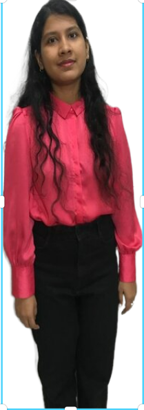

# Shreya Chakraborty

My name is Shreya Chakraborty. I hold an undergraduate degree in Electronic and Communication Engineering. After completing my degree, I worked as a software developer at Accenture for two years. Currently, I am pursuing a Master of Science in Business Analytics and Information Systems. I am aspiring to work as a data engineer and eventually as a data scientist one day.

